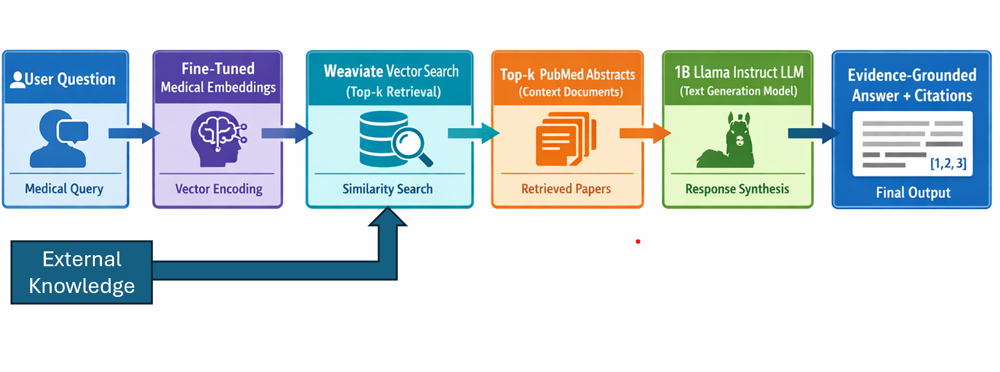

# Domain-Specialized Embedding Learning for Medical Retrieval-Augmented Generation (RAG)

## 1. Introduction
Large Language Models (LLMs) have demonstrated strong performance in natural language understanding and generation tasks. However, when applied to high-stakes domains such as medicine, these models often produce hallucinated or factually incorrect responses. This limitation poses significant risks in biomedical question answering, where accuracy, evidence grounding, and citation reliability are critical.

Retrieval-Augmented Generation (RAG) has emerged as a practical approach to mitigate hallucination by conditioning model outputs on retrieved external knowledge. In medical applications, RAG systems typically retrieve biomedical literature (e.g., PubMed abstracts) and provide context to an LLM before generating an answer. While this improves factual grounding, the effectiveness of RAG is highly dependent on the quality of the retrieval component.

In turn, the quality of retrieval depends mainly on the embedding model used. Generic embedding models are trained on broad web corpora and are not optimized for biomedical terminology, domain-specific abbreviations, or clinical semantic relationships.

This project investigates whether domain-specialized embedding learning can significantly improve retrieval accuracy and answer faithfulness in a medical RAG system. Specifically, we evaluate multiple embedding training strategies, including generic embeddings, biomedical pre-trained models, and contrastively fine-tuned domain embeddings within a controlled RAG architecture. The goal is to quantify how embedding specialization impacts retrieval metrics and downstream question answering performance.

## 2. Research Question
**Can domain-specific embedding training improve retrieval quality and reduce hallucinations in medical Retrieval-Augmented Generation (RAG) systems?**

## 3.Problem Statement
Large Language Models (LLMs) do not have up-to-date knowledge and often produce hallucinated or inaccurate answers in the medical domain. Retrieval-Augmented Generation (RAG) can mitigate this by grounding answers in external knowledge, but the retrieval quality depends heavily on the embedding model. Generic embeddings are not optimized for biomedical terminology, which can reduce retrieval relevance and answer faithfulness.

## 4. Project Objective
This project aims to design and evaluate a medical RAG system grounded in PubMed abstracts and systematically compare two embedding training strategies:
1. A baseline embedding model (general-purpose sentence embedding).
2. A domain-specialized embedding model trained or fine-tuned on biomedical literature.

The primary objective is to measure whether domain adaptation in the embedding layer leads to:
- Improved retrieval relevance (Recall)
- Higher citation alignment with retrieved documents
- Improved factual consistency in generated answers
- Reduced hallucination rate in medical question answering
By isolating the embedding model as the key experimental variable while keeping the retrieval database, language model, and prompting strategy constant, this study evaluates the direct impact of domain-specific embedding learning on end-to-end RAG performance.

## 5. System Architecture
### Proposed Method:
We will build a medical RAG system with the following pipeline:

### System Pipeline

1. PubMed abstracts are embedded using the embedding model.
2. Embeddings are stored in the Weaviate vector database.
3. User queries are embedded and used to retrieve relevant documents.
4. Retrieved biomedical evidence is passed to the LLM.
5. The LLM generates an evidence-grounded medical answer.

## 6. Dataset, Models, and Tools

This project leverages open-source datasets, embedding models, language models, and vector databases to build the medical RAG system.

### Dataset

| Dataset | Description | Source |
|-------|-------------|--------|
| PubMedQA | Biomedical question answering dataset containing expert-labeled answers and supporting abstracts. | https://huggingface.co/datasets/qiaojin/PubMedQA |
| MedQuAD | Training data for embedding fine-tuning | https://huggingface.co/datasets/lavita/MedQuAD |

### Embedding Model

| Model | Description | Source |
|------|-------------|--------|
| Qwen3-Embedding-0.6B | Lightweight embedding model used to generate vector representations of biomedical documents and queries. | https://huggingface.co/Qwen/Qwen3-Embedding-0.6B |

This model will be used as:
- **Baseline embedding model**
- **Fine-tuning starting point for domain-specialized embeddings**

### Language Model

| Model | Description | Source |
|------|-------------|--------|
| Llama-3.2-1B-Instruct | Instruction-tuned LLM. | https://huggingface.co/meta-llama/Llama-3.2-1B-Instruct |

The model will use retrieved PubMed abstracts as context and generate evidence-grounded answers for the user query.

### Vector Database

| Tool | Purpose | Source |
|-----|---------|--------|
| Weaviate Cloud | Vector database used to index biomedical documents and perform semantic search over embeddings. | https://console.weaviate.cloud |

Weaviate enables:
- Efficient similarity search
- Retrieval of relevant PubMed abstracts
- Integration with embedding models for RAG pipelines

